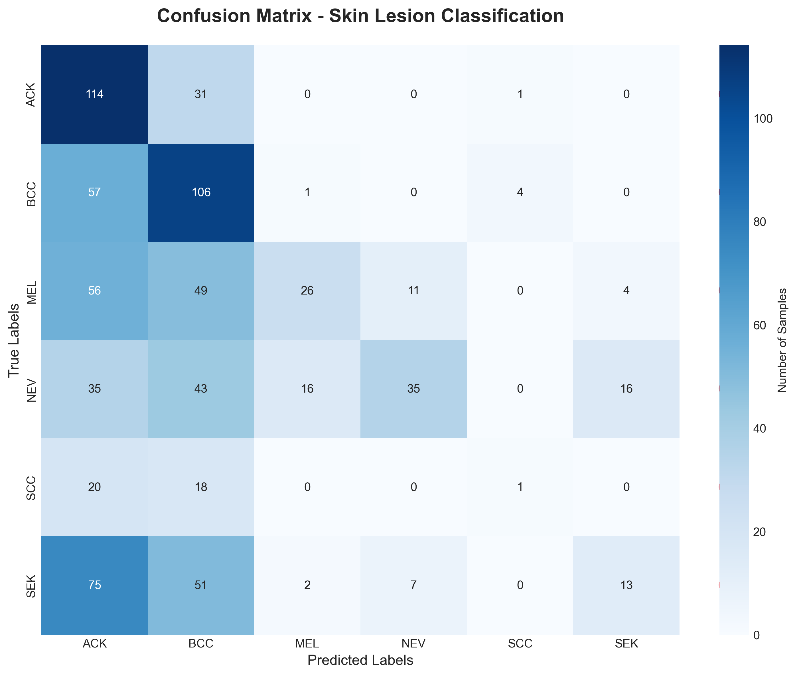
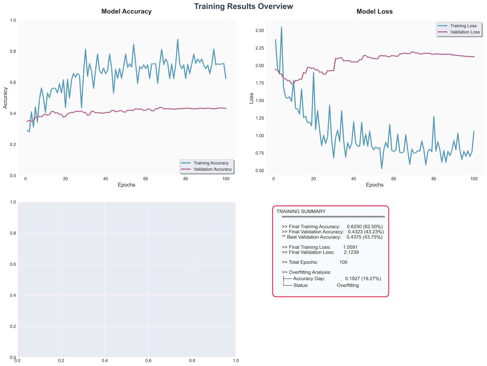
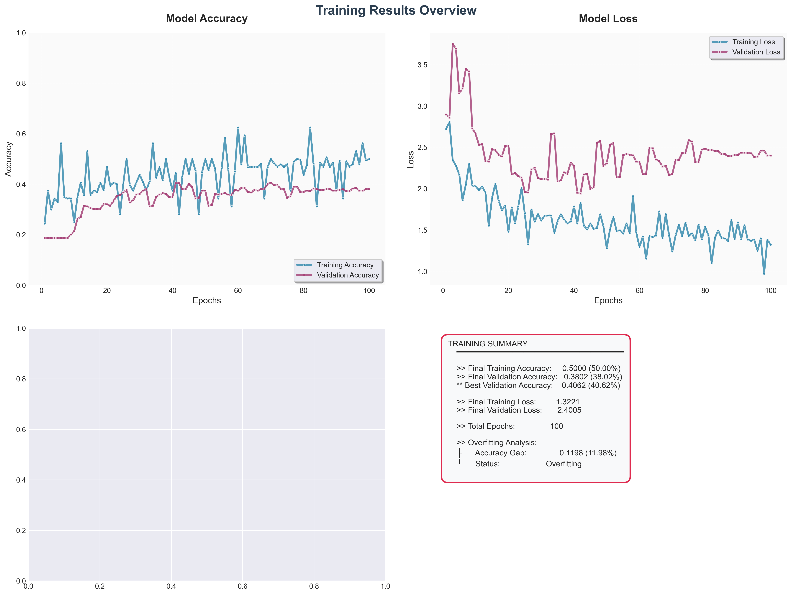

# Proyecto: Detección de Cáncer en la Piel por Clasificación de Imágenes

Este proyecto tiene como objetivo detectar cáncer en la piel a partir de imágenes de lesiones cutáneas utilizando técnicas de clasificación de imágenes. Para ello, se utiliza un dataset disponible en Kaggle:  
📁 [Skin Cancer (PAD-UFES-20)](https://www.kaggle.com/datasets/mahdavi1202/skin-cancer)

## 📊 Descripción del Dataset

El dataset contiene un total de **2,298 imágenes** correspondientes a **1,641 lesiones** de **1,373 pacientes**, abarcando **6 tipos diferentes de condiciones cutáneas**, divididas entre:

- **Cánceres de piel**:
    - BCC: Carcinoma Basocelular (Basal Cell Carcinoma)
    - SCC: Carcinoma de Células Escamosas (Squamous Cell Carcinoma)
    - MEL: Melanoma

- **Otras enfermedades cutáneas**:
    - ACK: Queratosis Actínica (Actinic Keratosis)
    - SEK: Queratosis Seborreica (Seborrheic Keratosis)
    - NEV: Nevus


### 📁 Estructura de los datos

- El dataset original viene comprimido en un `.zip` que contiene:
    - Una carpeta con **todas las imágenes sin clasificar**.
    - Un archivo `.csv` con **metadatos y etiquetas diagnósticas**.

### 🧬 Atributos en los metadatos (CSV)

El CSV contiene **26 atributos** por cada muestra. Algunos de los más relevantes son:

- `patient_id`, `lesion_id`, `img_id`: identificadores únicos.
- `diagnostic`: etiqueta con el tipo de lesión.
- `age`, `gender`, `region`: información del paciente.
- Factores de riesgo como: `smoke`, `drink`, `pesticide`, `skin_cancer_history`, `cancer_history`, etc.
- Características de la lesión: `itch`, `grew`, `hurt`, `changed`, `bleed`, `elevation`, `diameter_1`, `diameter_2`.
- `biopsed`: indica si la muestra fue confirmada por biopsia.

Cerca del **58% de las muestras son biopsiadas** y confirmadas por expertos dermatólogos.

---

## ⚙️ Preprocesamiento de Datos

Dado que las imágenes **no estaban organizadas en carpetas por tipo de cáncer**, se desarrolló el script `utils.py` para **reorganizar las imágenes** en carpetas según su diagnóstico.

1. Se lee el archivo `metadata.csv` para construir un **diccionario** con pares `lesion_id: diagnóstico`.
2. Se procesan todas las imágenes, extrayendo el `lesion_id` a partir del nombre de archivo, cuyo formato es:
    ```
    PAT_[patient_id]_[lesion_id]_[img_id].png
    ```

Ejemplo: `PAT_9_17_80.png`  
→ `lesion_id = 17`  
→ `diagnóstico = ACK`  
→ La imagen se mueve a la carpeta `/ACK`

3. Las imágenes se **reorganizan en carpetas**, una por cada diagnóstico (`ACK`, `BCC`, `MEL`, `NEV`, `SEK`, `SCC`).

---

## 📁 División del Dataset

Una vez reorganizadas las imágenes, se realiza la división del dataset en conjuntos de entrenamiento, validación y prueba:

- `train`: 70% de las imágenes.
- `validation`: 10% de las imágenes.
- `test`: 20% de las imágenes.

Cada carpeta (`train`, `validation`, `test`) contiene subcarpetas por tipo de diagnóstico.

La carpeta data contiene la siguiente estructura:

```
data/
├── metadata.csv
├── split_report.txt
├── full_images
├── organized_images
├── train/
│   ├── ACK/
│   ├── BCC/
│   ├── MEL/
│   ├── NEV/
│   ├── SEK/
│   └── SCC/
├── validation/
│   ├── ACK/
│   ├── BCC/
│   ├── MEL/
│   ├── NEV/
│   ├── SEK/
│   └── SCC/
└── test/
    ├── ACK/
    ├── BCC/
    ├── MEL/
    ├── NEV/
    ├── SEK/
    └── SCC/
```
### 📊 Reporte de División
El archivo `split_report.txt` contiene un resumen de la división del dataset, mostrando el número de imágenes por tipo de diagnóstico en cada conjunto (train, validation, test).
La carpeta `full_images` contiene todas las imágenes originales sin clasificar, mientras que `organized_images` contiene las imágenes reorganizadas por diagnóstico.
Despues las imágenes se dividen en conjuntos de entrenamiento, validación y prueba, asegurando que cada conjunto tenga una representación equitativa de cada tipo de diagnóstico.

> ⚠️ **Nota importante**  
En el GitHub solamente se puede encontrar dentro de la carpeta `data` el archivo `metadata.csv`, el archivo `split_report.txt` por razones de espacio, pero en el siguiente link a Drive se wncuentra el resto de los archivos:
[Google Drive](https://drive.google.com/drive/folders/1nR3f4mr7ylwR_OyzVkAkjps9zQubiuI6?usp=sharing)
>

## 🧠 Data Augmentation y Entrenamiento del Modelo

### 📈 Aumento de Datos

Para mejorar el rendimiento del modelo de clasificación, se aplicaron técnicas de **data augmentation** utilizando el notebook [`data_augmentation.ipynb`](./data_augmentation.ipynb).  
En este script:

- Se genera un **diccionario anidado** que contiene la información actual de cada carpeta (una por diagnóstico) y la **cantidad de imágenes** disponibles.
- Se evalúa el **balance del dataset** para determinar qué clases necesitan mayor augmentación.
- Se aplican transformaciones como rotaciones, zoom, flips horizontales y verticales, entre otras, para aumentar la diversidad del conjunto de datos de entrenamiento sin necesidad de recolectar más imágenes.

---

### 🧪 Modelo de Clasificación CNN

El modelo se define y entrena en el notebook [`cnn_dermai.ipynb`](./cnn_dermai.ipynb), inspirado en el artículo científico:
Tras investigar múltiples papers y probar diversas arquitecturas, se identificaron dos modelos que mostraron los mejores resultados con nuestro dataset.
> 📄 *Skin cancer classification using convolutional neural networks*  
> [IOP Science, 2020](https://iopscience.iop.org/article/10.1088/1757-899X/982/1/012005/pdf)

En este notebook:

- Se construye una arquitectura **CNN personalizada** basada en la propuesta del paper.
- Se entrena el modelo con el dataset de imágenes dermatológicas reorganizado.
- Se utilizan técnicas como:
  - Normalización de imágenes.
  - Callbacks como `ModelCheckpoint` y `EarlyStopping`.
- Al finalizar el entrenamiento, se guarda el modelo entrenado en el archivo `modelo_dermai.h5`, para su uso posterior en inferencia o despliegue.

# Arquitecturas Implementadas
Utilice 6 papers para implementar 6 modelos diferentes adaptados a mis necesidades como las dimenciones de mis images, cantidad de images, etc.
Estos dos modelos fueron lo que mejor funcionaron pero hubo un problema porque al anadir mas images a las clases MEL, NEV Y SEK el accurracy disminuyo.
### 1. Modelo basado en MobileNetV2
Basado en este paper
[CNN Comparative Analysis for Skin Cancer Classification](https://ieeexplore.ieee.org/document/9984324)
   2. Precisión obtenida:
      📊 Entrenamiento: 62.50% | ✅ Validación: 43.55%

| Layer (Type)                         | Output Shape       | Parameters   |
|-------------------------------------|--------------------|--------------|
| mobilenetv2_1.00_96 (Functional)    | (None, 3, 3, 1280) | 2,257,984    |
| global_average_pooling2d           | (None, 1280)       | 0            |
| dropout_15 (Dropout)               | (None, 1280)       | 0            |
| dense_8 (Dense)                    | (None, 128)        | 163,968      |
| batch_normalization (BatchNorm)   | (None, 128)        | 512          |
| dropout_16 (Dropout)               | (None, 128)        | 0            |
| dense_9 (Dense)                    | (None, 6)          | 774          |

**Total Parameters:** 2,423,238

## Características clave:

- MobileNetV2 preentrenada como extractor de características
- Dropout (50%) para reducir sobreajuste
- Batch Normalization para estabilizar el entrenamiento
- Capa densa final con 6 neuronas (una por clase)

Here are some example images used in the project:




- 
### 2. Modelo CNN Personalizado

## 🧠 CNN Model Architecture
Basado en este paper [Skin lesion classification of dermoscopic images using machine learning and convolutional neural network](https://www.nature.com/articles/s41598-022-22644-9)

| Layer (Type)                      | Output Shape        | Parameters     |
|----------------------------------|---------------------|----------------|
| conv2d_31 (Conv2D)               | (None, 96, 96, 32)  | 896            |
| batch_normalization              | (None, 96, 96, 32)  | 128            |
| max_pooling2d                    | (None, 32, 32, 32)  | 0              |
| dropout                          | (None, 32, 32, 32)  | 0              |
| conv2d_32 (Conv2D)               | (None, 32, 32, 64)  | 18,496         |
| conv2d_33 (Conv2D)               | (None, 32, 32, 64)  | 36,928         |
| batch_normalization              | (None, 32, 32, 64)  | 256            |
| max_pooling2d                    | (None, 16, 16, 64)  | 0              |
| dropout                          | (None, 16, 16, 64)  | 0              |
| conv2d_34 (Conv2D)               | (None, 16, 16, 128) | 73,856         |
| batch_normalization              | (None, 16, 16, 128) | 512            |
| conv2d_35 (Conv2D)               | (None, 16, 16, 128) | 147,584        |
| batch_normalization              | (None, 16, 16, 128) | 512            |
| max_pooling2d                    | (None, 8, 8, 128)   | 0              |
| dropout                          | (None, 8, 8, 128)   | 0              |
| flatten                          | (None, 8192)        | 0              |
| dense_13 (Dense)                 | (None, 1024)        | 8,389,632      |
| batch_normalization              | (None, 1024)        | 4,096          |
| dropout                          | (None, 1024)        | 0              |
| dense_14 (Dense)                 | (None, 6)           | 6,150          |

**🔢 Total Parameters:** 8,679,046 (33.11 MB)  
**🧠 Trainable Parameters:** 8,676,294 (33.10 MB)  
**🧊 Non-trainable Parameters:** 2,752 (10.75 KB)




---

## 👤 Autor

- **Dante David Pérez Pérez A01709226**
